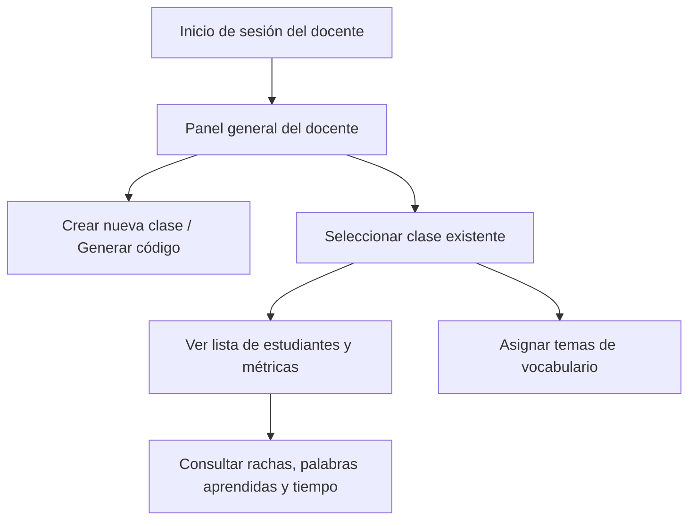
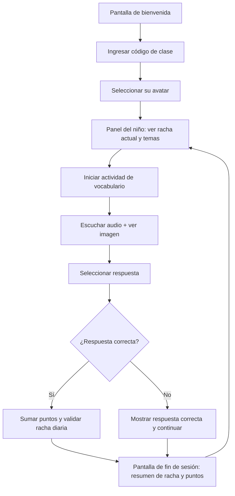

# Flujo de usuario: Inglés con Racha Diaria

Pantallas y transiciones de cada rol en la plataforma.

## Docente

```mermaid
flowchart TD
    A[Inicio de sesión del docente] --> B[Panel general del docente]
    B --> C[Crear nueva clase / Generar código]
    B --> D[Seleccionar clase existente]
    D --> E[Ver lista de estudiantes y métricas]
    E --> F[Consultar rachas, palabras aprendidas y tiempo]
    D --> G[Asignar temas de vocabulario]
```

## Niño

```mermaid
flowchart TD
    A[Pantalla de bienvenida] --> B[Ingresar código de clase]
    B --> C[Seleccionar su avatar]
    C --> D[Panel del niño: ver racha actual y temas]
    D --> E[Iniciar actividad de vocabulario]
    E --> F[Escuchar audio + ver imagen]
    F --> G[Seleccionar respuesta]
    G --> H{¿Respuesta correcta?}
    H -- Sí --> I[Sumar puntos y validar racha diaria]
    H -- No --> J[Mostrar respuesta correcta y continuar]
    I --> K[Pantalla de fin de sesión: resumen de racha y puntos]
    J --> K
    K --> D
```
